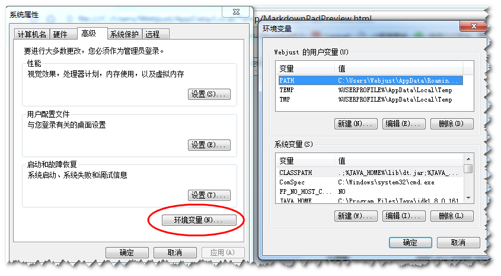
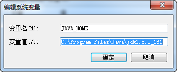
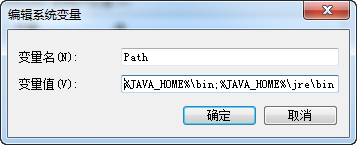
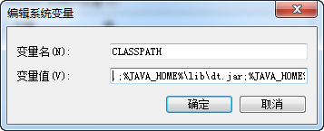
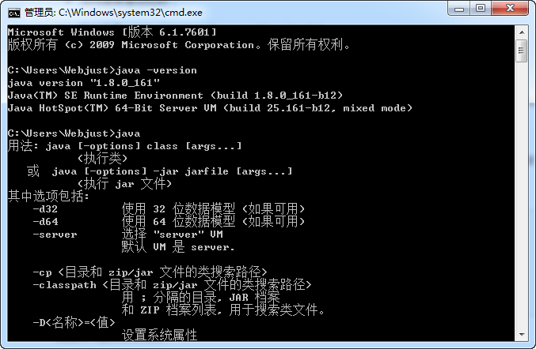
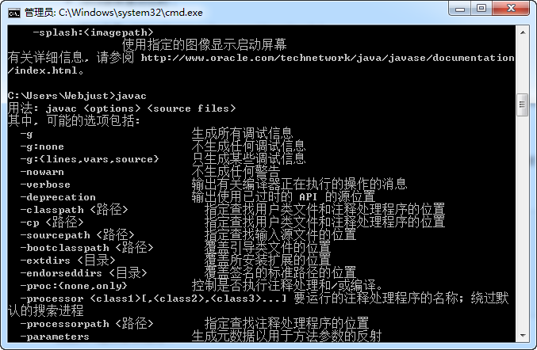
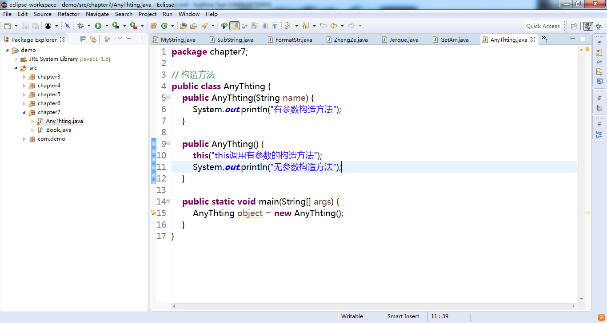
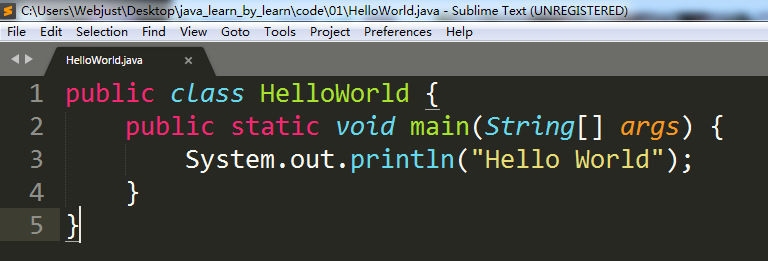
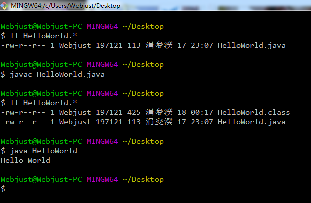
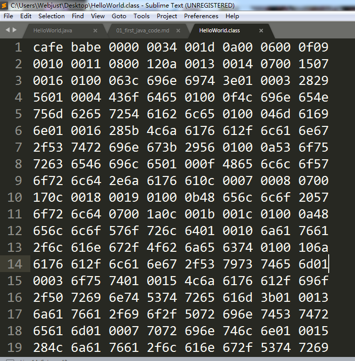

# Java简介
Java 是由Sun Microsystems公司于1995年5月推出的高级程序设计语言。Java可运行于多平台，如Windows, Mac OS, 及其他多种UNIX版本的系统。

# Java环境安装\编辑器准备
java开发工具包JDK：[http://www.oracle.com/technetwork/cn/java/javase/downloads/index.html](http://www.oracle.com/technetwork/cn/java/javase/downloads/index.html)

在「环境变量」中配置三个属性的值：JAVA_HOME，CLASSPATH，Path。

- 变量名：JAVA_HOME
- 变量值：C:\Program Files (x86)\Java\jdk1.8.0_91   // 要根据自己的实际路径配置

- 变量名：CLASSPATH
- 变量值：.;%JAVA_HOME%\lib\dt.jar;%JAVA_HOME%\lib\tools.jar;         //记得前面有个"."

- 变量名：Path
- 变量值：%JAVA_HOME%\bin;%JAVA_HOME%\jre\bin;

在CMD命令行中使用命令：java -version, java, javac 检测是否成功的安装了 Java JDK。

Java编辑器下载地址：http://www.eclipse.org/downloads/

# Java的第一个程序HelloWorld.java

如果你有过其他面向对象开发的编程，可以更加容易理解，Java本身也是一门面向对象的编程语言，整个的Java的程序可以理解为是对象的集合。

我们第一次接触，还不需要理解的非常深入，关键是能够找找Java的开发感觉。

比如这个简单的 「Hello World」入门的第一个代码，你要尽可能的彻底理解它，当然在后续我们学习Java的面向对象知识后，会比较深入的理解。

首先我们的代码文件名为：HelloWorld.java。
1. Java文件是 `.java` 后缀；
2. 文件名和类名要一致
3. 类名的首字母是要大写的，多个单词时，首字母要大写（遵循驼峰命名）。
4. 类名区分大小写。

在类当中定义了一个 main() 方法：
1. main() 方法是程序运行的入口；
2. public, static 是权限修饰的关键字(在后续的面向对象知识中会涉及到，暂时先不理解那么深入)
3. main(String[] args) 也可以写成 main(String args[]), 括号中()传入的是参数；不同于PHP的语法，在Java中定义变量时必须制定变量的类型，这里定义的是一个名词为 args 的字符串类型的数组。(关于更多的数据类型：诸如整型、浮点数、字符、布尔，会在后面的章节涉及到)

System.out.println("Hello World") 怎么理解呢？从它最早实现的功能会比较好理解，它的作用是输出“Hello World”字符串。
1. System.out.println() 是Java提供给我们的方法，关于更多的像字符串操作、数学运算等等...我们只需要死记硬背就可以了！至于为什么这么写，后面慢慢就明白啦！比如："."语法就是访问对象的方法的运算符。(先理解到这里，不要着急)
2. System.out.print() 少了 ln，2者之间最大的区别是，一个换行，一个不换行。(^_^, 自己敲代码会印象更深刻的哦，我也是通过敲代码发现2者之间的区别的！)

# 运行Java第一个程序

为了方便大家能够更加清楚的对比，我使用 git bash 来运行我们的第一段java代码，大家也可以使用 CMD 工具，效果是一样的。

首先在运行之前，当前文件夹只有：HelloWorld.java 文件；
执行命令：javac HelloWorld.java 就会生成 HelloWorld.class 文件(二进制文件)
然后执行命令：java HelloWorld 就会执行我们的java程序，输出Hello World。

通过这个实例，我们能够初步的理解Java代码的编写和运行过程啦！是不是觉得这种感觉很奇妙！

虽然，目前我们的代码只是最最简单的输出一个字符串，但是这是一个最好的开始！

彩蛋：前面我们看到的 abcde 纯字符的 HelloWorld.java 文件经过javac命令编译后的 HelloWorld.class 二进制(机器可以懂的代码)是长这样的：

写代码，就是每天进步一点点！